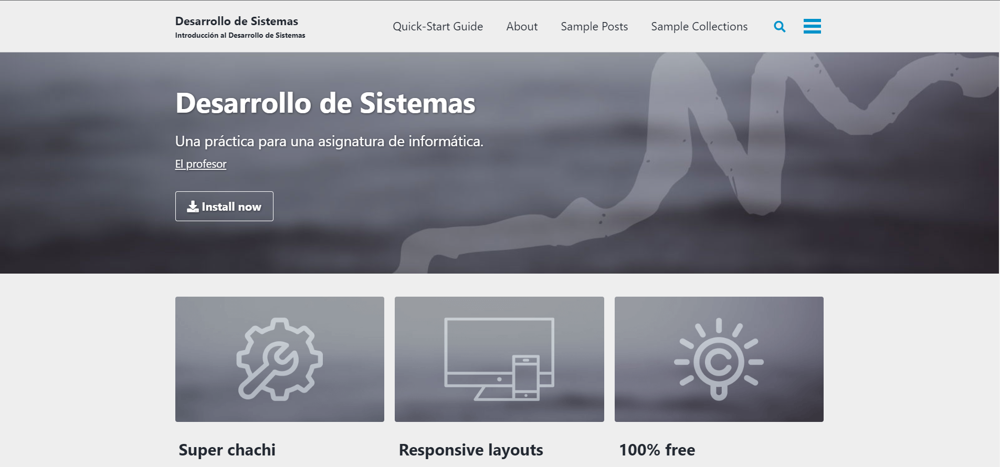
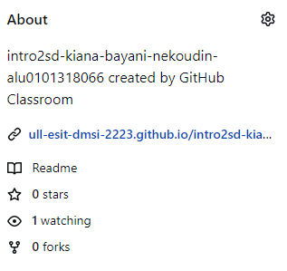
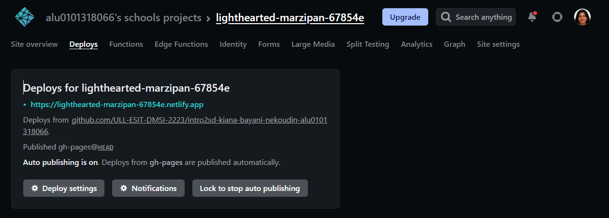
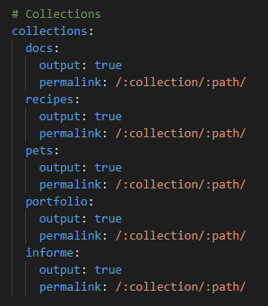
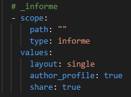
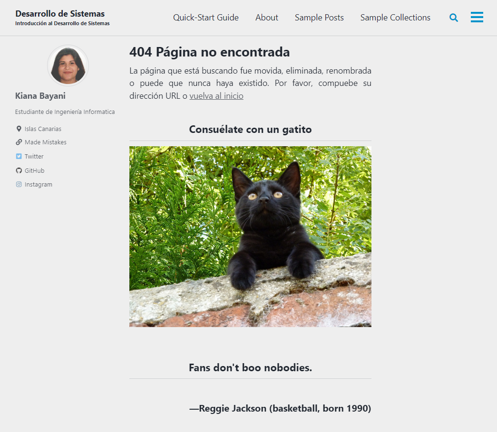

## Reconfiguración de _config.yml
Al editar el archivo *_config.yml* se permite configurar la mayoría de los valores de Jekyll, como los temas y los plugins del sitio web. 
{: style="text-align: justify;"}

En este caso, se han modificado los siguientes parametros:

| **VALORES** | **CAMBIOS** |
|:--------:|:-------:|
| **minimal_mistakes_skin** | *air* |
| **locale** | *es-ES* |
| **title** | *Desarollo de Sistemas* |
| **subtitle** | *Introducción al Desarrollo de Sistemas* |
| **name** | *Kiana Bayani* |
| **description** | *Creación de una página web haciendo uso de Jekyll para la asignatura de DMSI* |
| **base_url** | */intro2sd-kiana-bayani-nekoudin-alu0101318066/* |
|-------------------|

## Despliegue del sitio web en GitHub Pages haciendo uso de Jekyll
Para poder hacer el despliegue de nuestra página usando gh-pages hay que realizar el siguiente comando: *npx gh-pages -d _site*.
{: style="text-align: justify;"}

- **npx:** es un ejecutor de paquetes basados en *Node.js*.
- **gh-pages:** es un paquete que contiene un módulo de despliegue automático que realiza las tareas necesarias para desplegar nuestra página web del repositorio en los servidores de gh-pages. Es decir, crea automáticamente una rama *gh-pages* en nuestro repositorio donde sitúa los archivos necesarios para el despliegue de la página web.
{: style="text-align: justify;"}

 

Enlazamos, además, la página web a nuestro perfil:
 

## Despliegue del sitio web en Netlify
Para poder desplegar nuestra página web en Netlify es necesario, primero, crear una cuenta en la misma. Esta cuenta debe estar enlazada a nuestra cuenta de GitHub para que funcione correctamente. 
{: style="text-align: justify;"}
 

Además, hay que recordar de cambiar el repositorio que vamos a desplegar a público, ya que para desplegar un repositorio privado es necesario una suscripción.
{: style="text-align: justify;"}

Por otro lado, no hay que olvidarse de modifcar los ajustes necesarios utilizados en el build. Para ello, hay que modificar el archivo *_config.dev.yml* y añadir la línea:
{: style="text-align: justify;"}

~~~
baseurl:""
~~~

Luego, es necesario volver a los ajustes básicos de despliegue de Netlify y cambiar el comando que realizará el despliegue. Es decir, hay qye cambiar *npm run build* a *jekyll build --config_config.yml,_config.dev.yml*. Si no realizamos estos cambios, la página web se desplegará incorrectamente.
{: style="text-align: justify;"}

## Utilización de liquid
Se ha creado un archivo denominado *tutu.json* en la carpeta *_data* donde se encuentra un poco de información sobre el tema resumido. Para que esto sea visible en el informe, se ha hecho uso de **liquid**. El cual se trata de un lenguaje de plantilla que nos permite exhibir datos en la misma.
{: style="text-align: justify;"}

Trozo de código utilizado en la página *intro2sd.md*:

~~~

     
    * {{ contenidos }}
    
    {{ contenidosd }}
    
    

     
    * {{ contenidos }}
     
        {{ contenidoss }}
    
    

~~~

Trozo de código utilizado en la página *README.md*:

~~~

El capítulo resumido es el {{ site.data.tareas.capitulos[1] }} del libro {{ site.data.tareas.titulo }}.

~~~

## Creación de una Jekyll Collection
Se ha creado una colección que incluye un post con un vídeo de youtube y el resumen realizado. 
En el archivo *_config.yml*, se define la colección en la sección de *collections* denominada *informe*:
{: style="text-align: justify;"}

 
Se añade el parámetro *output = true* para que Jekyll cree una página:
{: style="text-align: justify;"}
 

 
El capítulo resumido es el {{ site.data.tarea.capitulos[1] }} del libro {{ site.data.tarea.titulo }}.

## Creación de una página 404 personalizada
Se ha creado un fichero denominado *404.md* donde se han detallado los parámetros necesarios para la creación de la página 404 de nuestra web.
{: style="text-align: justify;"}

Se ha hecho uso de los servicios web *CAT API* y *QUOTE API* para que cada vez que se entre a la página nos muestre una imagen aleatoria de un gato y una cita famosa con su autor.
{: style="text-align: justify;"}

Un ejemplo de la página 404 es la siguiente:
{: style="text-align: justify;"}

